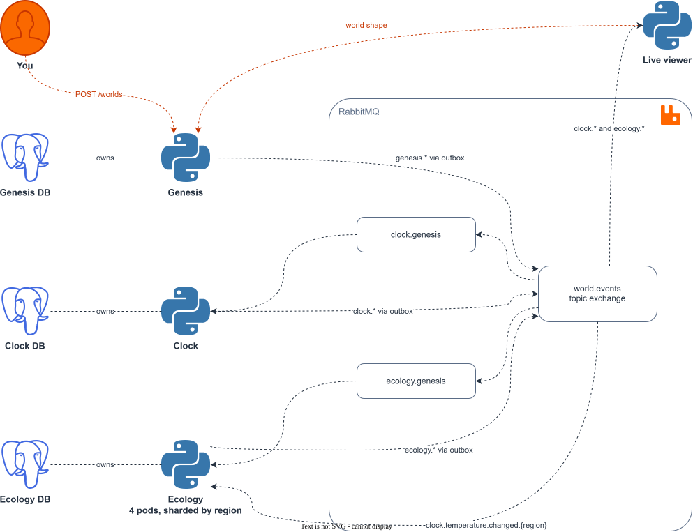
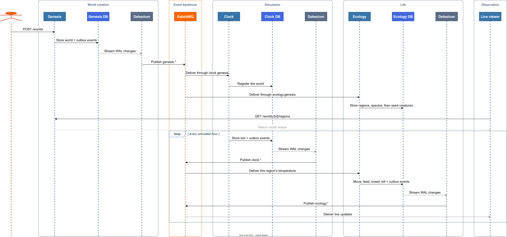

# World Simulator (Arathia)

> Owain Hughes // owainjhughes@gmail.com // github.com/owainjhughes/world-simulator

## Overview



_Editable source: [`docs/architecture.drawio`](docs/architecture.drawio)._

Arathia is a distributed simulation of a living world, built to learn distributed computing.

A world is generated once: three continents and two island groups carved into twenty named regions, each populated with its own invented species that have diets, temperature preferences, movement types and a food web. From then on the world runs on its own. Time passes, seasons turn, temperatures rise and fall with the hour and the season, weather comes and goes region by region, and several hundred individual creatures walk, swim and fly around the map hunting, grazing, breeding and dying.

Nothing in the system calls anything else directly. Each service announces what has happened as events on RabbitMQ, and any service that cares subscribes. Every service owns its own database.

Here is a world Genesis produced, one character per tile, `.` for open sea:

```
....................................................................................................
.................................bbbbbb..............wwwwwww........................................
...............................bbbbbbbbbb..........wwwwwwwwwwww.....................................
...............................bbbbbbbbbbbb......wwwwwwwwwwwwwww....................................
..............................bbbbbbbbbbbbcccccccwwwwwwwwwwwwwww....................................
..............................bbbbbbbbbbbbccccccccwwwwwwwwwwwwww....................................
..............................bbbbbbbbbbbcccccccccwwwwwwwwwwwwwww...................................
...............................bbbbbbbbbbccssssssccwwwwwwwwwwwwww...................................
.................................bbbbbbbcccsssssscccwwwwwwwwwwww....................................
...................................bbbbbccccssscccccwwwwwwwwwww.....................................
....................................bbbbcccccccccccccwwwwwwwww......................................
............................................cccccccccwwwww..........................................
....................................................................................................
....................................................................................................
....................................................................................................
...................................ddd..............................................................
..................................ddddd...........................................y.................
..................................ddddd..........................................yyyy...............
..................................ddddd........................................yyyyyyy..............
...................................ddd.........................................yyyyyyyy.............
..................kkkk.......................................................yyyyyyyyyy.............
...............kkkkkkkkkk..................................................yyyyyyyyyggg.............
..............kkkkkkkkkkttt...............................................yyyyyyyyygggg.............
..............kkkkkkkkktttt.............................................yyyyyyyyygggggg.............
.............kkkkkkkkktttttt...........................................yyyyyyyyyygggggg.............
............kkkkkkkktttttttt..........................................yyyyyyyyyyygggggg.............
...........kkkkkkkkttttttttt..........................................yyyyyymmmmmmmmmmm.............
...........kkkkkkttttttttttt.........................................yyyyyymmmmmmmmmmmm.............
...........kkkkktttttttttttt..........................................yyyy.mmmmmmmmmmm..............
..........vvvvvvvvvvvvvtttt...........................................yyy.....mmmmmmmm..............
..........vvvvvvvvvvvvvvvv....................................................mmmmmmm...............
..........vvvvvvvvvvvvvvv.................................................aaaaaaxxxxxx..............
.........vvvvvvvvvvvvvvvv................................................aaaaaaxxxxxxxx.............
.........rrrrvvvvvvvvvvv.................................................aaaaaaxxxxxxxx.............
........rrrrrrrrrrrrrlll................................................aaaaaaaxxxxxxx..............
........rrrrrrrrrrrrrlll................................................aaaaaaaaxxxxxx..............
........rrrrrrrrrrrrrrr.................................................aaaaaaaaxxxxxx..............
........rrrrrrrrrrrrrrr..................................................nnnnnnnnnnxx...............
........rrrrrrrrrrrrrrr.................................................nnnnnnnnnnnnn...............
.........rrrrrrrrrrrrrr................................................oonnnnnnnnnnn................
.........rrrrrrrrrrrrrrr...............................................ooooooooooo...........zzzz...
.....rrrrrrrrrrrrrrrrrrr................................................ooooooooo..........zzzzzz...
...ppp.....rrrrrrrrrrrrr..................................................fffffff.........zz...zz...
...pp.......rrrrrrrrrrr..................................................fffffff...............zz...
....pppp.....rrrrrrrrrr..................................................ffffff...............zzz...
.................rrrrrr..................................................f..................zzz.....
............................................................................................zz......
............................................................................................z.......
....................................................................................................
....................................................................................................
```

Roughly 21% of the map is land. The coastline and the region borders are fixed, so every world is drawn from the same map and Arathia is recognisable every time. What the seed changes is the life on it: the species, their traits and the food web wiring them together are rolled fresh each run, so no two worlds behave the same.

Ocean is simply any tile no region owns, which makes water a real barrier: something that walks cannot cross it, something that swims can, and something that flies does not care.

## Map

Here is the original painted map that the world creation is based off of:


## Features

- Procedural world generation: twenty regions across three continents and two island groups, each with its own climate, rainfall and plant life
- Invented species per region, named from word banks, with randomised traits and a predator/prey food web wired by climate, diet and running speed
- A world clock with day/night, four seasons, and temperature that follows both the hour and the time of year
- Per-region weather, where snow rather than rain falls if the region is below freezing
- Individual creatures that move, graze, hunt, breed, starve and freeze, with populations that boom and crash against the food supply
- Fully event-driven: services never call each other, fully pub/sub
- Ecology shards itself across pods by region, dividing the map between however many replicas are running
- A live terminal viewer that draws the world and its creatures, and updates as it runs
- Runs either on Docker Compose or on a local Kubernetes cluster with Kind

# How to Run Locally

## What you need

- [Docker](https://www.docker.com/products/docker-desktop/)
- [uv](https://docs.astral.sh/uv/) — only if you want to run the services outside containers
- [kind](https://kind.sigs.k8s.io/), [kubectl](https://kubernetes.io/docs/tasks/tools/), [Helm](https://helm.sh/) and [Skaffold](https://skaffold.dev/), only for the Kubernetes route

Or skip installing any of that: the repo has a [dev container](.devcontainer/devcontainer.json) with the whole toolchain inside, Docker included. Open the folder in VS Code and "Reopen in Container" (or open it in GitHub Codespaces), and both the Compose and Kind routes below work as-is inside it.

## 🐳 The quick way: Docker Compose

This is the fastest way to see it working.

_Run in the root of this repo:_

```sh
make run
```

That starts RabbitMQ, a Postgres database for each service, all three services (four Ecology replicas among them) and a [Debezium](https://debezium.io/) relay for each database, waits for them to be healthy, creates a world if none exists yet, and opens the live viewer.

_The same thing as individual steps:_

```sh
make up       # start the stack
make world    # create a world - always makes a new one
make viewer   # watch it
```

`make world` creates another world every time you run it, while `make run` only creates one if there are none. Extra worlds sit idle until a clock claims them.

If you would rather just read the logs, `make logs` follows the clock:

```
clock  | day 2 17:00 winter - 19 regions, 26 events
clock  | day 2 18:00 winter - 19 regions, 31 events
```

`make logs-ecology` follows the life instead, where each pod reports the patch of the world it currently holds:

```
ecology-2  | seeded world 2e1f9511-8e9c-4056-bd88-444578c38f5d with 556 creatures across 19 regions
ecology-3  | holding 5 regions: gloamwoods kagotsuma korees lominasa stragglefaun
```

## ☸ Kubernetes with Kind

### 🛞 Create a cluster

The cluster config is in [deploy/kind-cluster.yaml](deploy/kind-cluster.yaml). It creates one control plane and two workers, maps four ports out to your machine so you can reach the services and the RabbitMQ dashboard, and pins the Kubernetes API to port 6443.

_Run in the root of this repo:_

```sh
make create-cluster
```

`make clean-cluster` deletes it again.

> [!NOTE]
> The API port is pinned on purpose. Left alone, kind picks a random loopback port, and Docker Desktop drops that binding when it restarts, which leaves your kubeconfig aimed at a port nothing is listening on and every `kubectl` call failing. Pinning it means a recreated cluster always lands in the same place.

### 🚀 Build, load and deploy

Kind cannot pull images built on your machine, so every deploy means four steps: build the image, load it into the cluster, install the chart, wait for the rollout. The Makefile exposes each step on its own, and `deploy-local` runs all four in order.

```sh
make deploy-local
```

For actual development there is a better mode. [Skaffold](https://skaffold.dev/) watches your files, and on every save rebuilds the image, redeploys the chart, and tails the pod logs until you Ctrl+C:

```sh
make dev
```

> [!IMPORTANT]
> `make dev` does not currently work on Windows with Helm 4. Skaffold installs a render plugin into Helm by creating a symlink, and Windows refuses that without elevation. Skaffold [issue #9988](https://github.com/GoogleContainerTools/skaffold/issues/9988) tracks it and the fix in [PR #10108](https://github.com/GoogleContainerTools/skaffold/pull/10108) is not merged yet, so upgrading Skaffold does not help. Installing Helm 3.x instead is the known workaround. Everything else, including `make deploy-local`, works fine on Helm 4.

The config is [skaffold.yaml](skaffold.yaml): one artifact built from the same Dockerfile Compose uses, deployed through the Helm chart rather than raw manifests. Each build gets a unique tag, which is what makes the Deployments roll on their own, no restart needed.

### ⎈ The chart

Everything that runs in the cluster comes from one chart in [deploy/helm/arathia](deploy/helm/arathia). It has no dependencies. The Postgres StatefulSets, the RabbitMQ Deployment and the Debezium relays are all written out here rather than pulled in from someone else's chart, because seeing them is the point of the exercise.

Six templates, three of which are loops rather than one file per service:

| Template | What it makes |
| ------------------------ | ------------------------------------------------------------------------------------ |
| `postgres.yaml` | One StatefulSet and one headless Service per entry in `databases` |
| `debezium.yaml` | One relay Deployment per entry in `databases` |
| `services.yaml` | One Deployment per entry in `services`, plus a NodePort Service where one is asked for |
| `rabbitmq.yaml` | The broker and its two NodePorts |
| `secret.yaml` | Credentials, with every connection URL derived rather than written out |
| `debezium-config.yaml` | The relay config all three relays share |

`databases` is nothing more than a list of three names, and the rest falls out of it: the relay for `clock` knows to read `clock-db` and publish under the `clock.` prefix without any of that being stated anywhere. The services genuinely do differ, so `services` carries the real differences per entry, which is what starts it, how many replicas, whether it needs the broker, and whether it gets a NodePort.

The Secret is worth a note. It used to be a file you wrote by hand, and it stated the credentials five times over: once as a user and password, then again inside each of the four connection URLs. Change the password and four of the five went stale without a word. The chart derives all four, so they cannot drift:

```sh
helm template deploy/helm/arathia --set credentials.postgresPassword=hunter2
```

To see exactly what the chart produces before any of it reaches the cluster:

```sh
make render-helm
```

That writes `deploy/helm/render.yaml` and opens it. It is the fastest way to find out why a template is not doing what you thought.

> [!TIP]
> There is only one image. Genesis, Clock and Ecology are the same codebase started with different commands, which each Deployment sets for itself.

> [!NOTE]
> **The services will crash a few times on first deploy, and that is fine.** They start before their databases are ready, fail, and Kubernetes restarts them until it works. You will see `CrashLoopBackOff` for a minute or so before everything settles. This is the intended way to handle startup ordering in Kubernetes.

Watch them come up:

```sh
kubectl get pods -n ecosystem -w
```

Once everything is `Running`, create a world and watch it go:

```sh
curl -X POST http://localhost:18810/worlds
kubectl logs -n ecosystem deployment/clock -f
```

Or let one command do the whole thing — deploy, wait for the rollout, create a world if none exists, and open the viewer:

```sh
make run-kind
```

### 🌍🌍 Running more than one world

Each clock pod runs exactly one world, so the number of clock replicas is the number of worlds actually running. Create a second world, scale the clock, and watch the new pod claim it:

```sh
make world-kind
kubectl scale deployment/clock -n ecosystem --replicas=2
```

`make viewer-kind` opens the world menu against the cluster, where you can see which pod-run worlds are ticking, view one, or create and delete them.

### 🧬 Watching Ecology resplit the map

Ecology divides regions between however many replicas are running, so scaling it is worth watching:

```sh
kubectl scale deployment/ecology -n ecosystem --replicas=8
kubectl logs -n ecosystem -l app=ecology -f --prefix
```

The pods that were holding too much give regions back within a couple of seconds and the newcomers pick them up, each logging the regions it now holds. Scale back down and the survivors reclaim what the departed pods were holding once their heartbeats go stale. No pod is ever told how many regions or how many peers exist.

# Using the Services

## Where things are

| Service            | Docker Compose       | Kubernetes (Kind)    |
| ------------------ | -------------------- | -------------------- |
| Genesis API        | localhost:18800      | localhost:18810      |
| Swagger UI         | localhost:18800/docs | localhost:18810/docs |
| RabbitMQ dashboard | localhost:18802      | localhost:18812      |
| genesis-db         | localhost:18803      | inside cluster only  |
| clock-db           | localhost:18804      | inside cluster only  |
| ecology-db         | localhost:18806      | inside cluster only  |

The RabbitMQ dashboard logs in with `dev` / `dev`. It is worth opening — you can watch queues fill and drain in real time.

## 👁 Watching the world

```sh
make viewer
```

That opens a small menu listing every world. Worlds a clock pod is actively running show their current day and season; worlds no pod has claimed show as idle. From here you can view a world, create a new one, or delete one:

```
  Arathia worlds (1 running)
  1. bb20562b  seed 1542680042  idle
  2. efd5d4eb  seed  961835526  day   2 17:00 winter

  [v]iew N   [c]reate   [d]elete N   [r]efresh   [q]uit
```

The menu learns which worlds are running by listening to the event stream for a few seconds — there is no "running worlds" table anywhere, because the lease that says who runs a world lives in the Clock's own database, and services never read each other's databases. The events themselves are the shared truth.

Deleting a world works the same way in reverse: Genesis removes it and announces `WorldDeleted`, the Clock hears that and drops its copy, and whichever pod was running the world exits its lease and claims another world if one is free.

Picking `v` opens the map viewer for that world. It reads the world's shape from Genesis over HTTP, then subscribes to everything the Clock and Ecology publish, ignoring events from every other world. Quit it with Ctrl+C to fall back to the menu.

Each region is drawn in its own colour with the sea in between, and every creature alive in the world is drawn on the tile it is standing on: a white `o` for a herbivore, a red `A` for a carnivore, a yellow `&` for an omnivore. A tile is two characters wide, so the creature takes the first and any falling rain or snow takes the second, and the two never fight over the same square.

The key is grouped by continent and runs north to south, with each island group listed among the neighbours it sits nearest. After the name comes the temperature, then how many creatures are alive there, then the weather:

```
  Arathia   day 6  13:00  winter

    [the map, in colour,      Northsaw
     with the creatures         Boring Tundra   -14.4C   43
     moving across it and       Wailing Firth     0.3C  320 snow sunshine
     ocean in between]          Shard Forest    -12.9C   17
                                Chillcap Peaks  -29.5C   33 snow sunshine

                              Kuerigo
                                Doreidrassil     12.3C   36 rain
                                Korees           -4.1C   71 snow
                                Trynwyn           8.0C   91 sunshine wind
                                Wyldvale         11.4C   65 sunshine
                                Lominasa          9.1C   18 rain sunshine
                                Ranatis          20.5C   45 wind

                              Eastern Isles
                                Yoonhye Forest   10.1C  102 wind
                                Tyrglen           4.7C   15 sunshine
                                Morghaan          1.6C   16 rain sunshine
                                The Wreck        21.6C   11 wind
                                Denn Arctogh    -25.0C   18 sunshine wind
                                Wylenn            8.5C   31 sunshine
                                Gloamwoods        5.5C   29 rain sunshine
                                Kagotsuma        20.8C   36 rain
                                Stragglefaun     25.6C   60 wind

  World log
   day 6 12:00  sunshine started in Gloamwoods
   day 6 13:00  sunshine started in Tyrglen
   day 6 13:00  snow stopped in Tyrglen
   day 6 13:00  wind stopped in Wylenn
   day 6 13:00  rain stopped in Wyldvale
   day 6 13:00  wind started in Denn Arctogh
   day 6 13:00  wind started in Stragglefaun
   day 6 13:00  rain started in Kagotsuma
```

That is a real frame, 504 creatures across the world on the sixth day. The populations are worth reading against the climates beside them: Wailing Firth is a torrential estuary and carries 320 creatures, while The Wreck is volcanic badlands with almost no rain and supports eleven. Nothing enforces that directly. It falls out of how fast grazed ground grows back.

The log carries weather and life side by side, so kills and extinctions scroll past among the rain. Two days earlier the same log read:

```
   day 4 19:00  rain stopped in Kagotsuma
   day 4 19:00  Glintquill Grazer killed Rimelurk in Korees
```

> [!NOTE]
> Weather changes far more often than anything dies, so the ten-line log is mostly rain and wind. Kills are worth waiting for rather than expecting on every frame: a full predator only hunts every few days.

The viewer holds no state of its own and never talks to a database. It is just another subscriber, which is what makes it a good demonstration of the whole design: you can start it, stop it, and start it again, and the simulation neither knows nor cares.

## 🌍 Genesis API

| Endpoint               | Method | Description                                                  |
| ---------------------- | ------ | ------------------------------------------------------------ |
| `/worlds`              | POST   | Generate a new world. Optional `?seed=` for a repeatable one |
| `/worlds`              | GET    | List every world that has been generated                     |
| `/worlds/{id}`         | DELETE | Delete a world and announce it, so the Clock drops it too    |
| `/worlds/{id}/regions` | GET    | The regions of a world, with climate and tiles               |
| `/worlds/{id}/species` | GET    | Every species in a world, with its full trait sheet          |
| `/health`              | GET    | Health check, used by the Kubernetes probes                  |
| `/docs`                | GET    | Swagger UI                                                   |

Creating a world returns a summary:

```json
{
  "world_id": "d4012ec2-3389-4fe9-af32-6b6aeb2156d5",
  "seed": 2001031555,
  "regions": 19,
  "species": 153
}
```

And the species come out looking like this:

```
Hollowskitter        omnivore   fly   speed 11.5  -26.0..9.2C  resident
                     hunts: Thorncreep Warden, Frostshade Warden, Saltfin, Wisppelt Hound, Sallowcrawl, Gloamhowl
                     eats: bitterroot, moss, lichen
Silttusk             omnivore   fly   speed 9.0   -29.4..12.8C  resident
                     hunts: Saltfin, Frostshade Warden, Ashtusk Wanderer
                     eats: bitterroot, moss
Sallowcrawl          herbivore  swim  speed 5.8   -26.4..13.2C  resident
                     eats: bitterroot, moss
```

Two rules shape those trait sheets, and both exist so that Ecology has a food web that actually works. A species only eats plants that grow in the region it was generated for, and a predator is only given prey it could plausibly catch: slower than itself, and living in the same temperatures. Sallowcrawl above is on Hollowskitter's menu, and both tolerate roughly the same cold.

## 🦌 Ecology

Ecology is where the world stops being scenery. Every creature is a row in Postgres with a position, an age, a hunger and a stress level, and once an hour each one moves, eats or gets eaten, breeds if it can and dies if it must.

It has no loop of its own. The Clock already announces the temperature in every region once per simulated hour, and Ecology treats that announcement as the heartbeat: one `clock.temperature.changed.<region>` event is one hour of life in that region. So the service that owns time drives the service that owns life without either of them knowing the other exists.

**An hour in a region**, in order:

1. Grazed ground grows back a little, faster where it rains harder and faster in spring than in winter.
2. Every creature ages an hour, gets hungrier, and gains or sheds temperature stress depending on whether the region is currently inside its comfortable range. Anything that runs out of time, food or endurance dies here.
3. Everything that is not hunting moves first, then the hunters move, so a predator chases where the prey went rather than where it was. Creatures stay on their own region's tiles, except swimmers and flyers, which may also use the sea directly off their coast.
4. Any hungry predator that ends its move next to something on its prey list eats it.
5. Grazers eat from the tile they are standing on, taking only what their hunger needs.
6. Two fed, unstressed, grown adults of the same species standing next to each other produce one offspring and then both rest for a few days.

Because breeding needs a *pair* who happen to meet, a species scattered too thinly cannot recover even when conditions are perfect, which is what makes extinction stick.

**How many creatures a region gets** is not a number anyone picked. It falls out of the food supply: a region's carrying capacity is its land area multiplied by how fast its vegetation regrows, which comes from its rainfall. Torrential Wailing Firth supports hundreds; arid Ranatis, despite being the largest region on the map, supports a few dozen. Species settle where the climate suits them year-round and at least one of their food plants grows, so most live where they were generated and a hardy few spread into neighbouring regions that look like home. Predators only settle where their prey actually live, and only as many as that prey base can feed.

The result is a world that swings rather than sits still. Populations climb until they have eaten the ground bare, crash, and climb again as the vegetation recovers, with winter squeezing the whole cycle harder than summer does.

### Sharding by region

Ecology runs as four replicas, and they divide the map between themselves with no configuration saying who gets what. Each pod writes a heartbeat row to a shared table, then works out its own share by dividing the number of region shards by the number of pods currently alive, handing the remainder to the lowest-named pods so that every pod's share adds up to exactly the number of regions. It claims free regions until it reaches that share, and gives the surplus back if it is holding more. Sharing out the remainder is what stops a pod starving: if every pod simply rounded its share up, they could all sit at their limit while one held nothing and none of them owed it anything.

That is the whole rebalancing mechanism, and it means the split adapts on its own:

```
ecology-2  holding 1 regions: korees
ecology-2  holding 3 regions: gloamwoods kagotsuma korees
ecology-2  holding 5 regions: gloamwoods kagotsuma korees lominasa stragglefaun
ecology-4  seeded world 45dec22f-036e-4b9c-9fc4-0f0c7606241f with 225 creatures
```

Add regions to the atlas and every pod's share rises, so the new ones get picked up on the next cycle. Scale the deployment up and the pods holding too much release regions until everyone is even. Scale it down and the leftover regions are reclaimed once the dead pods' heartbeats go stale. Nothing needs to be told how many regions exist.

> [!NOTE]
> A region nobody currently holds keeps its creatures but does not step, so life there is paused rather than lost. Scale Ecology to zero and the world freezes exactly where it was.

### Seeding a world

When Genesis creates a world it announces `genesis.world.created`, carrying the seed and how many regions and species it made. Ecology stores that alongside the regions and species as they arrive, and a background sweep seeds any world whose parts have all turned up, rolling the starting creatures from the world's own seed so the same seed produces the same opening population.

That sounds more roundabout than "seed it when the last message arrives", and the reason is worth spelling out: the four pods share one queue, so RabbitMQ hands each of the thirty-nine creation messages to whichever pod is free. No single pod sees the last one, and none of them can assume the others have committed yet. Waiting for the data to be complete, rather than for a particular message, is the only version of this that works.

## 📬 Watching a single region's events

Every region-scoped event ends its routing key with the region name, which means you can subscribe to exactly one region and ignore the other eighteen. This is how Ecology pods listen to only their own patch of the world.

To see it, create a queue bound to just one region and peek at what lands in it:

```sh
# Create a queue that only receives Gloamwoods events
curl -u dev:dev -X PUT http://localhost:18802/api/queues/%2F/peek.gloamwoods \
  -H "content-type: application/json" -d '{"durable":true}'

curl -u dev:dev -X POST http://localhost:18802/api/bindings/%2F/e/world.events/q/peek.gloamwoods \
  -H "content-type: application/json" -d '{"routing_key":"clock.#.gloamwoods"}'

curl -u dev:dev -X POST http://localhost:18802/api/bindings/%2F/e/world.events/q/peek.gloamwoods \
  -H "content-type: application/json" -d '{"routing_key":"ecology.#.gloamwoods"}'
```

Wait a few seconds, then read the messages in the RabbitMQ dashboard under **Queues → peek.gloamwoods → Get messages**. You will see only Gloamwoods, and nothing from anywhere else:

```
[clock.temperature.changed.gloamwoods]      Gloamwoods   1.2C
[ecology.census.gloamwoods]                 Gloamwoods   42 creatures
[clock.temperature.changed.gloamwoods]      Gloamwoods   2.0C
[ecology.census.gloamwoods]                 Gloamwoods   42 creatures
[clock.temperature.changed.gloamwoods]      Gloamwoods   3.5C
[clock.weather.sunshine.started.gloamwoods] Gloamwoods   sunshine
[ecology.census.gloamwoods]                 Gloamwoods   43 creatures
```

That is a real capture, and the pattern in it is the whole design in miniature: every temperature reading is followed by a census, because the Clock's announcement is what makes Ecology step that region. In the last pair something was born, and Gloamwoods went from 42 creatures to 43.

_Remember to delete the queue when you are done, or it will fill up forever:_

```sh
curl -u dev:dev -X DELETE http://localhost:18802/api/queues/%2F/peek.gloamwoods
```

# Design

## 🎨 Directory Structure

Everything lives under [`src/`](src), split into three layers so it is easy to find what you are looking for:

```
src/
  app/        genesis/   clock/   ecology/   viewer/
  domain/     world.py  wordbanks.py  seasons.py  weather.py  ecology.py  events.py
  infra/      genesis/  clock/  ecology/  messaging/
```

- **`domain/`**: the rules of the world, with no I/O at all. World generation, species traits, how temperature moves through a day, when it rains, and every rule about how creatures move, feed, breed and die. You can read and test all of it without a database or a broker anywhere near it, which is exactly what the unit tests do: `domain/ecology.py` simulates an hour of a region given nothing but a list of creatures, a patch of vegetation and a temperature.
- **`infra/`** — everything that talks to the outside world: database engines, SQLAlchemy models, the RabbitMQ consumer and the outbox.
- **`app/`**: the entrypoints, which wire the two together. HTTP routes for Genesis, the tick loop and event handlers for Clock, the region leases and event handlers for Ecology, the renderer for the viewer.

The services share one codebase and one image, and differ only in the command they are started with. They still deploy separately, own separate databases, and never read each other's tables.

## 📡 Events

Services communicate through a RabbitMQ topic exchange called `world.events`. A publisher never knows who is listening.

No service publishes to RabbitMQ directly, because writing to the database and then publishing are two separate writes, and a crash between them would leave a fact in the database that nobody was ever told about. Instead, each service writes its events into an `outbox` table in the same transaction as the data they describe, and a [Debezium Server](https://debezium.io/documentation/reference/stable/operations/debezium-server.html) instance per database reads them straight out of Postgres's write-ahead log and publishes them — the transactional outbox pattern. The routing key and JSON body on the wire are exactly what the service wrote into the table.

> [!NOTE]
> The `outbox` tables are always empty, and that is not a bug. Each event row is inserted and deleted in the same transaction — Debezium reads the WAL, not the table, so the insert still reaches the broker while the table never grows.

> [!IMPORTANT]
> Debezium infers the shape of each payload from the JSON itself, and that has two consequences worth knowing before you add an event. An empty list is dropped from the message entirely, so a herbivore arrives with no `prey` field at all rather than an empty one, and every list in a payload must hold one kind of thing: `[[12, 4], [13, 4]]` survives the trip but `[[12, 4, "h"]]` does not. Both of these were found the hard way, by watching messages arrive mangled.

### A world on the wire

The same architecture is easier to follow as a sequence. This is the path from creating a world to watching its live weather updates:



_Editable source: [`docs/sequence.drawio`](docs/sequence.drawio)._

| Event                | Routing key                                    | Published by |
| -------------------- | ---------------------------------------------- | ------------ |
| `WorldCreated`       | `genesis.world.created`                        | Genesis      |
| `RegionCreated`      | `genesis.region.created`                       | Genesis      |
| `SpeciesGenerated`   | `genesis.species.generated`                    | Genesis      |
| `WorldDeleted`       | `genesis.world.deleted`                        | Genesis      |
| `DayArrived`         | `clock.day.arrived`                            | Clock        |
| `NightArrived`       | `clock.night.arrived`                          | Clock        |
| `SeasonChanged`      | `clock.season.changed`                         | Clock        |
| `SeasonProgressed`   | `clock.season.progressed`                      | Clock        |
| `TemperatureChanged` | `clock.temperature.changed.{region}`           | Clock        |
| `WeatherStarted`     | `clock.weather.{condition}.started.{region}`   | Clock        |
| `WeatherStopped`     | `clock.weather.{condition}.stopped.{region}`   | Clock        |
| `RegionCensus`       | `ecology.census.{region}`                      | Ecology      |
| `CreatureBorn`       | `ecology.creature.born.{region}`               | Ecology      |
| `CreatureDied`       | `ecology.creature.died.{cause}.{region}`       | Ecology      |
| `SpeciesExtinct`     | `ecology.species.extinct.{region}`             | Ecology      |
| `ComfortChanged`     | `ecology.comfort.{stressed or eased}.{region}` | Ecology      |

Putting the region at the end of the routing key is what makes `clock.#.wylenn` and `ecology.#.wylenn` work as subscriptions. The cause of death is in the middle of the key rather than the body for the same reason: `ecology.creature.died.starved.#` is a subscription to famine everywhere.

The census carries every living creature's position once an hour, which is what lets the viewer draw a world it keeps no state about. Individual movements are deliberately not published: at a few hundred creatures a region that would be thousands of messages every two seconds, and nothing would be learned from it that the census does not already say.

## ⏳ How time works

One tick advances the world by one simulated hour, and a tick fires every two real seconds by default (`TICK_SECONDS`). A season is 30 days, so a year is 120 days — about an hour and a half of real time to watch a full cycle.

Temperature is not random. Each region has a climate band, and the reading combines where you are in the year with where you are in the day, plus a little noise. So Denn Arctogh is bitter all year and merely unpleasant in summer, while Ranatis swings wildly between night and afternoon.

## 🗄 A database each

Genesis, Clock and Ecology have their own Postgres instances and cannot see each other's tables. This is deliberate and it is the source of most of what makes distributed systems interesting: if Clock wants to know what regions exist, it cannot run a join, it has to listen for the events, or ask over HTTP.

Clock listens. It declares its durable queue before anything else, so worlds created while it was down still arrive as events, and every clock pod shares that queue and one database — whichever pod receives a world's creation event registers it for all of them.

Registration and running are two different things. A registered world just sits in the table until a clock pod claims it: each pod takes out a lease on exactly one world (`SELECT ... FOR UPDATE SKIP LOCKED`, so two pods can never grab the same row), renews it on every tick, and simulates only that world. A pod that finds nothing to claim idles and retries. If a pod dies, its lease expires within 30 seconds and the next pod to start picks the world up. So the number of clock replicas is the dial for how many worlds are actually running — `kubectl scale deployment/clock --replicas=3` means three live worlds, assuming three worlds exist to claim.

Ecology leases the same way but at a finer grain: the unit is one region of one world rather than a whole world, and a pod holds several. It also has to know that creatures exist without Genesis ever telling it, which is the point. Genesis publishes species as facts about the world; what actually lives where is Ecology's own conclusion, drawn from those facts and stored in its own database.

## 📚 Stack

- **Python 3.13+ with [uv](https://docs.astral.sh/uv/)**
- **[FastAPI](https://fastapi.tiangolo.com/) and [Pydantic](https://docs.pydantic.dev/)**
- **[RabbitMQ](https://www.rabbitmq.com/)**
- **[PostgreSQL](https://www.postgresql.org/)**
- **[Debezium Server](https://debezium.io/)**
- **[Docker Compose](https://docs.docker.com/compose/), [Kind](https://kind.sigs.k8s.io/) and [Helm](https://helm.sh/).**

# Development

Dependencies are managed with [uv](https://docs.astral.sh/uv/):

```sh
uv sync
```

That installs the project itself as well as its dependencies, so `app`, `domain` and `infra` are importable anywhere without setting `PYTHONPATH`.

You can run either service directly against the containerised infrastructure, which is much faster than rebuilding images:

```sh
# Start just the infrastructure (--no-deps stops the Debezium relays dragging in the containerised services)
docker compose up -d rabbitmq genesis-db clock-db ecology-db
docker compose up -d --no-deps debezium-genesis debezium-clock debezium-ecology

# Run the services on your machine
uv run uvicorn app.genesis.main:app --port 8000
uv run python -m app.clock.main
uv run python -m app.ecology.main
```

All three read `DATABASE_URL` from the environment. Clock also reads `AMQP_URL` and `TICK_SECONDS`, Ecology reads `AMQP_URL`, and the viewer reads `WORLD_ID`.

## 📝 Testing

```sh
make test     # everything
make unit     # domain only, no services needed
make e2e      # needs the stack running
```

The **unit tests** cover the `domain/` layer, which is all pure functions: that seasons fall on the right days, that temperature stays inside a region's climate band, that snow falls below freezing and rain above it, that the same seed rebuilds the same world, and that no predator is ever given a carnivore to hunt or prey it could never catch.

Ecology is the biggest beneficiary of keeping the rules free of I/O. An hour of life is a function from creatures, vegetation and a temperature to a new set of creatures, so the tests can state things directly: that a creature with nothing to eat starves, that cold builds up until it kills and warmth undoes it, that a predator closes in while its prey runs, that a fed and settled pair breeds while a lone creature does not, that swimmers can leave the coast and walkers cannot, and that the last of a species dying is announced.

The **end-to-end tests** need `make up` first, and exercise the whole chain rather than mocking it. They create a real world through the API and check it comes back complete, watch the broker to confirm every creation event is published, confirm that exactly one world is emitting temperature readings covering all twenty regions, and wait for a census from every region with creatures in it. Two of them bind a queue to a single region's routing key, one for Clock and one for Ecology, and assert nothing from anywhere else arrives.

> [!NOTE]
> The end-to-end tests create real worlds and assume a single clock replica: only one world ever runs, and the extras stay registered but unclaimed and silent. Run them before scaling the clock up, and run `docker compose down -v` if you want to start from an empty slate.

# Looking Forward

This is a work in progress and there is plenty I know is missing or wrong.

- **Clocks do not redistribute worlds.** A pod claims one world at startup and holds it for life, so scaling down orphans a world until a new pod appears, and a `kubectl rollout restart` leaves up to 30 seconds of silence while the old pod's lease expires. Ecology now rebalances its regions properly; Clock should learn the same trick.
- **Worlds pile up.** Genesis will create as many as you ask for, and each sits registered until a clock claims it. There is still no way to pause, stop or delete a world — only to stop running it.
- **No unit tests for the app layer.** The domain layer is covered, but the tick loop, event handlers, region leases and HTTP routes are only exercised end to end.
- **No Migration service yet.** Creatures live and die inside one region and never cross a border, so a region that loses a species stays empty forever and `transport` only decides whether something can use the sea off its own coast. Migration is where handoffs, sagas and eventual consistency actually bite, and it is the next thing to build.
- **A world whose creation events go missing never comes alive.** Ecology waits for every region and species before it seeds, which is right, but if a message is genuinely lost the world sits there empty with no way to ask Genesis to say it all again. A replay endpoint, or seeding from an HTTP read of Genesis after a timeout, would close that hole.
- **Ecology's tuning is hand-picked.** Lifespans, hunger rates, regrowth and how much a predator eats are constants chosen by watching populations rise and fall until they stopped collapsing. They are plausible rather than derived, and a different set would give a different-feeling world.
- **No observability.** The plan is OpenTelemetry with SigNoz, so a single world creation can be traced across all three services.
- **The viewer is a terminal program.** A browser-based map, driven by an Observation service that keeps a read model of the world, is the proper version of this.
- **Hand-written database manifests.** Real clusters use operators — CloudNativePG for Postgres, the RabbitMQ Cluster Operator for the broker — which handle clustering, failover and backups. Writing the StatefulSets by hand was worth doing once to understand them, but it is not what you would run.
- **NodePorts instead of an Ingress.** Fine for Kind, not for anything real.
- **A homemade event envelope.** [CloudEvents](https://cloudevents.io/) is the standard for exactly this and would have been the smarter starting point.
